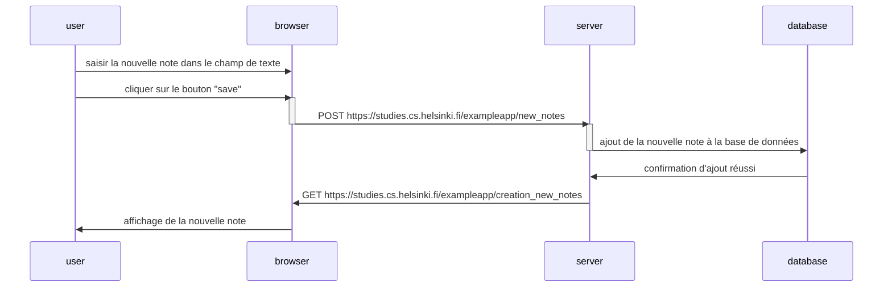

```mermaid
sequenceDiagram
    participant user
    participant browser
    participant server
    participant database


    user->>browser: saisir la nouvelle note dans le champ de texte
    user->>browser: cliquer sur le bouton "save"
    activate browser

    browser->>server: POST https://studies.cs.helsinki.fi/exampleapp/new_notes
    deactivate browser

    activate server
    server->>database:ajout de la nouvelle note à la base de données
    deactivate server

    database->>server: confirmation d'ajout réussi
    server->>browser:GET https://studies.cs.helsinki.fi/exampleapp/creation_new_notes
    browser->>user: affichage de la nouvelle note
```

    